# frontEnd

<h3>My Tasks to learning FrontEnd</h3>

1. HTML, CSS
2. JQuery
3. JavaScript

My Task "bicycle shop": https://bicyclefoxmind.tk/

1.1 Holy Grail
 
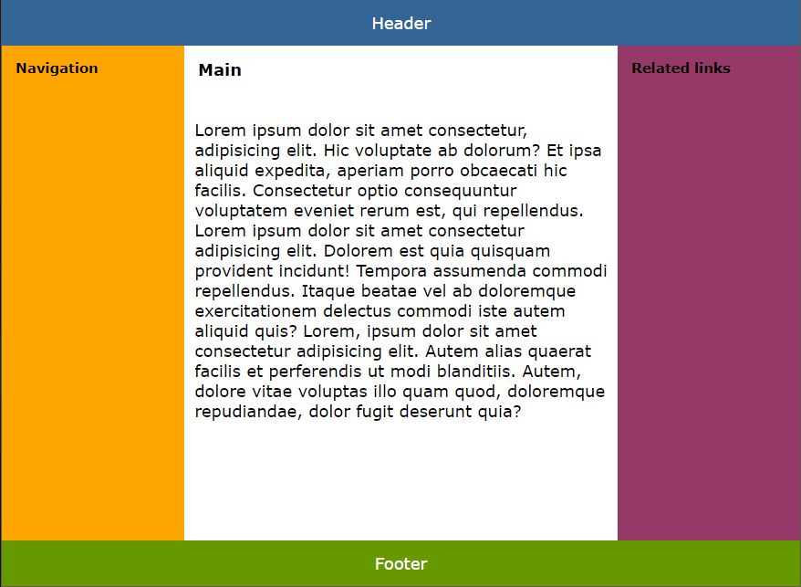
  

1.2 Media queries
 
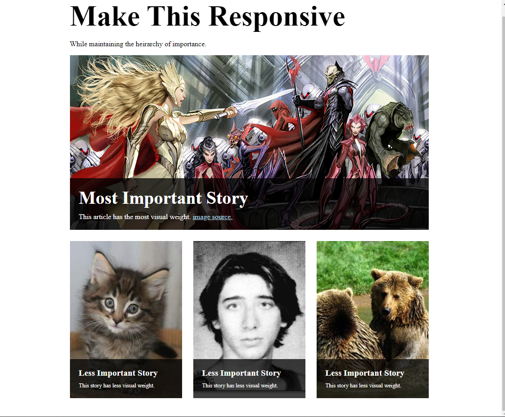
  

1.3 Carusel CSS only
 
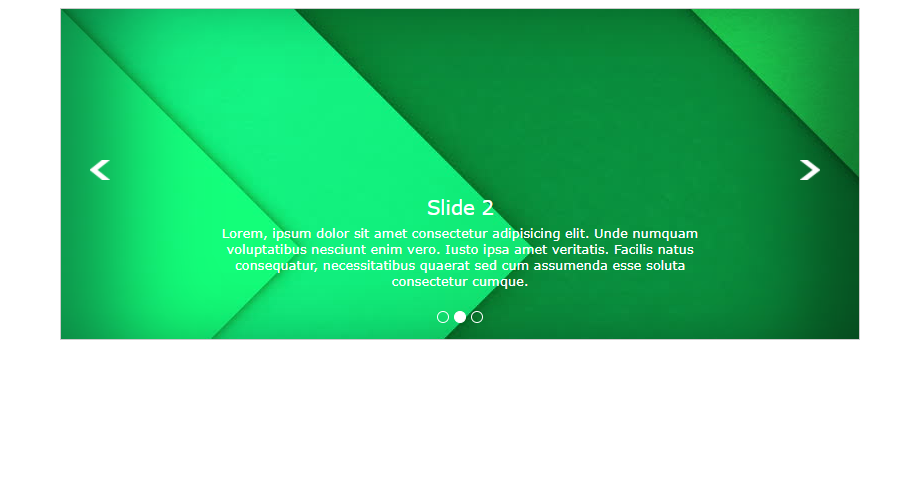
  

1.4 Product List
 
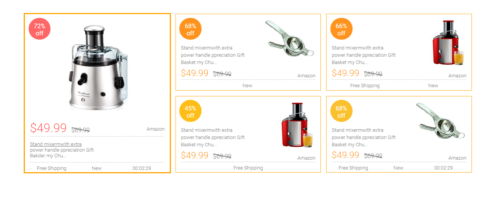
  

1.5 Bike shop website
 
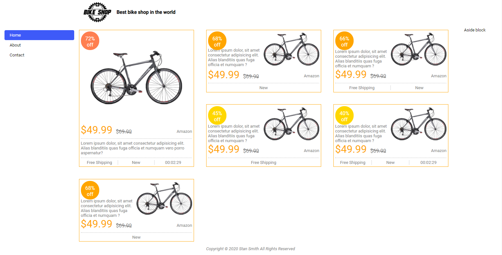
  

1.6 ToDo List
 
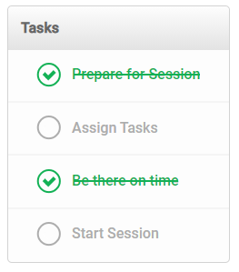
  

1.7 Button
 

  

2.1 Dialog Box
 
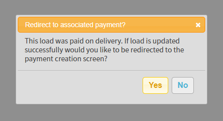
  

2.2 Datepicker
 
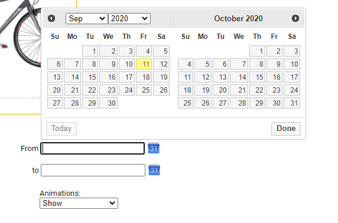
  

2.3 Autocomplete
 
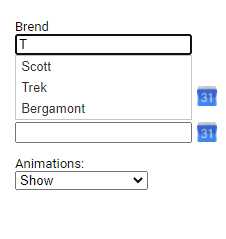
  

2.4 Form Widget
 
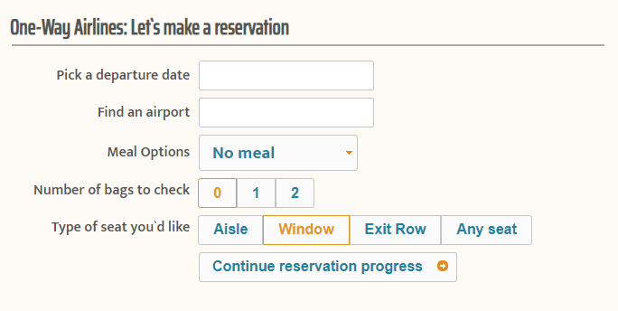
  

2.5 Drag and Drop
 
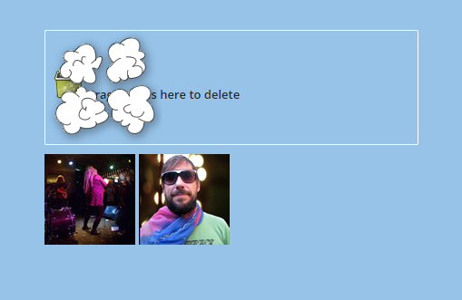
  

2.6 Ajax navigation
 
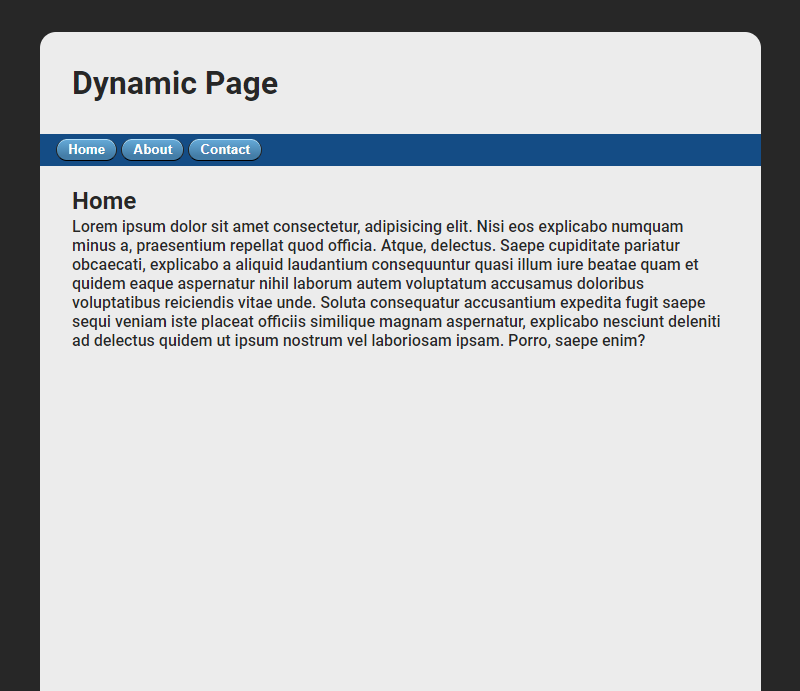
  

2.7 Receive to Flickr
 

  

2.8 Feedback Form
 
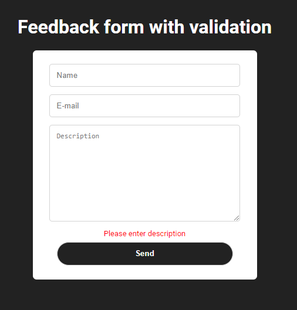
  

2.9 Image Carusel
 
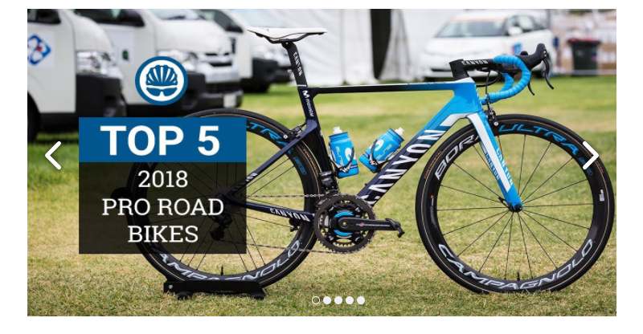
  

2.10 Todo app
 
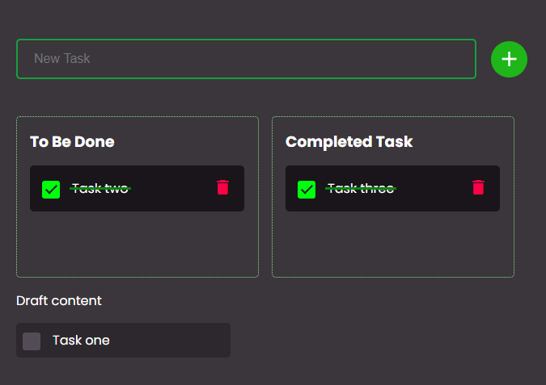
  

3.1 Registration form with walidation
 

  

3.2 Order form with validation 
 
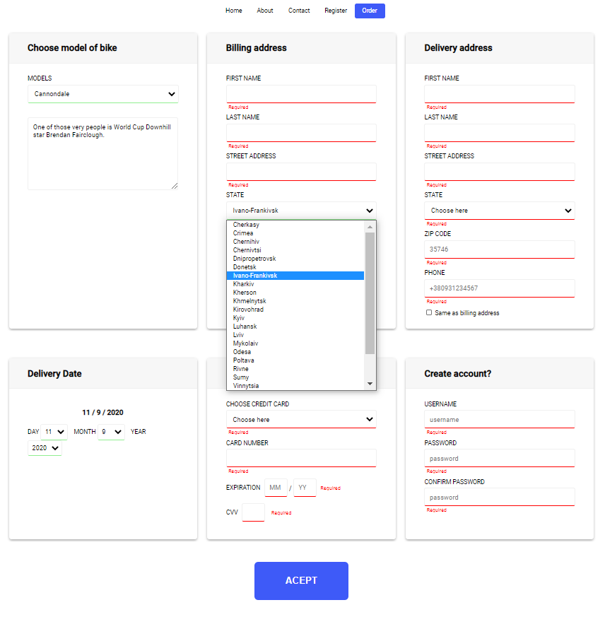
  

3.3 Image Carosel with loupe
 
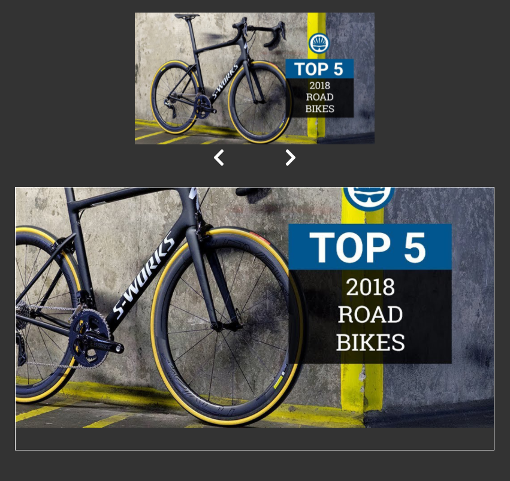
  

3.4 OOP
 
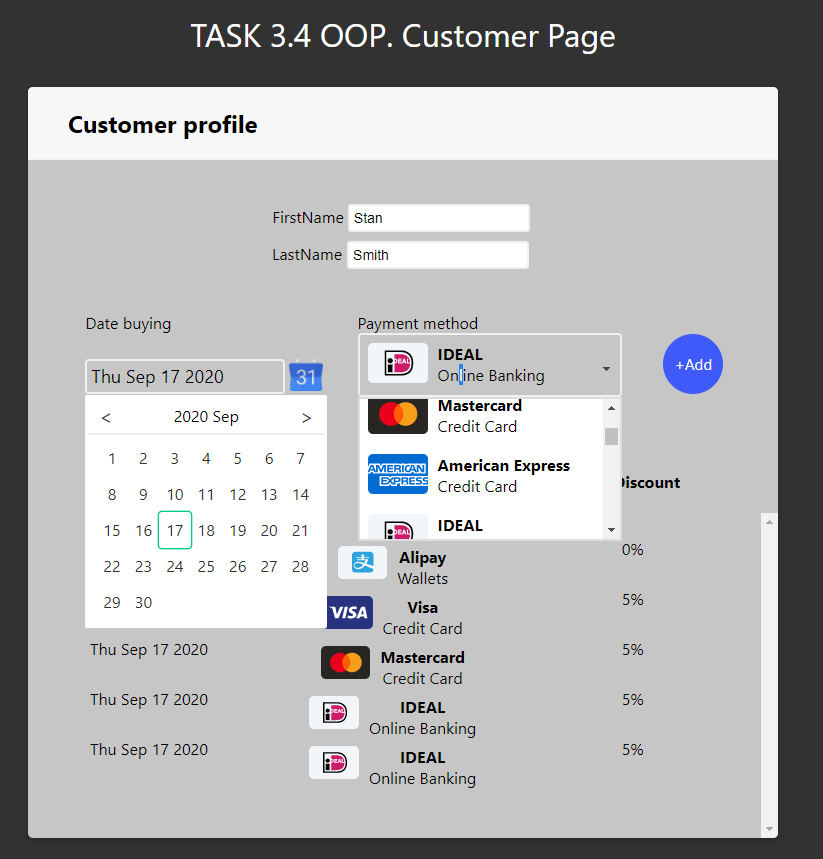
  

3.5 Weather
 
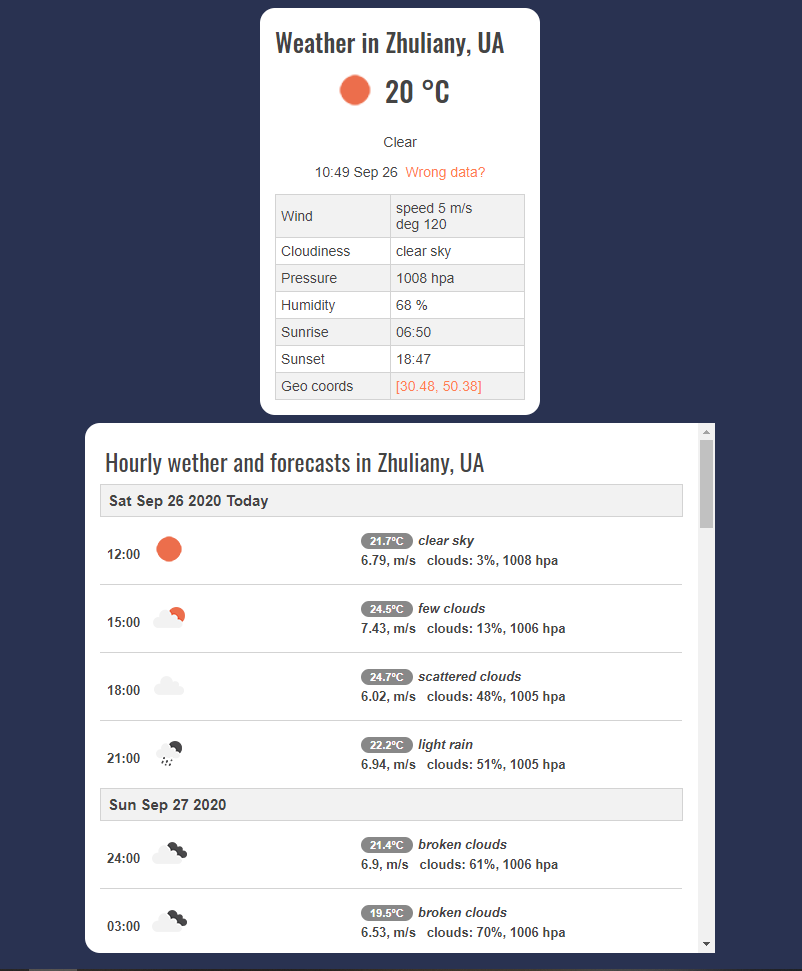
  
